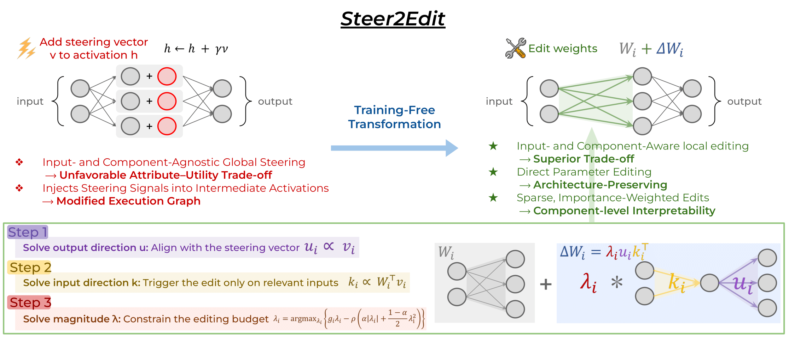
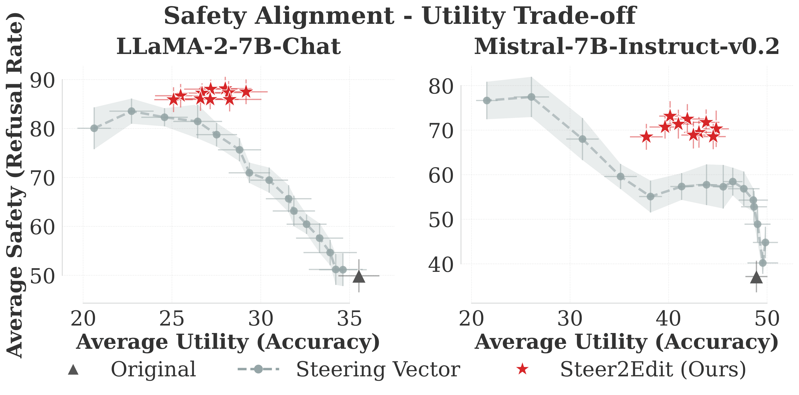
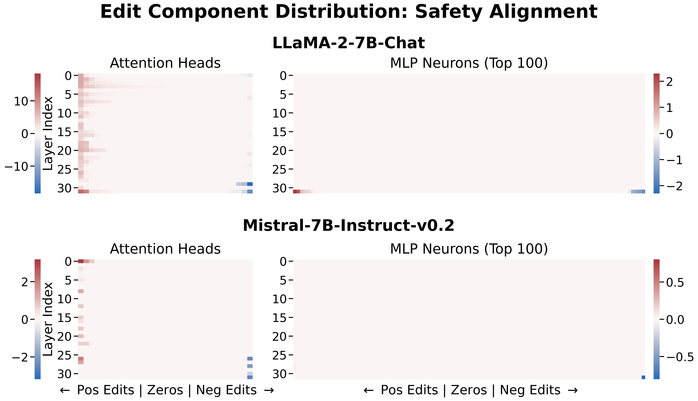
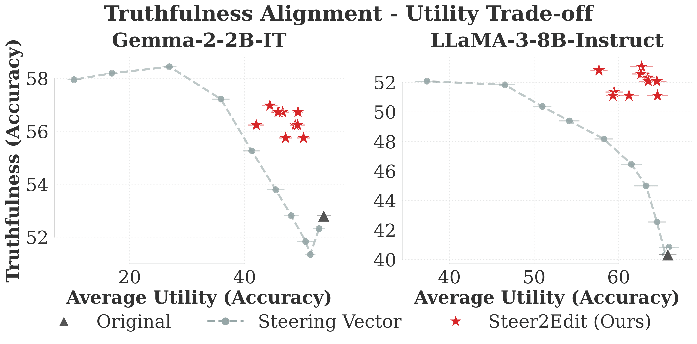
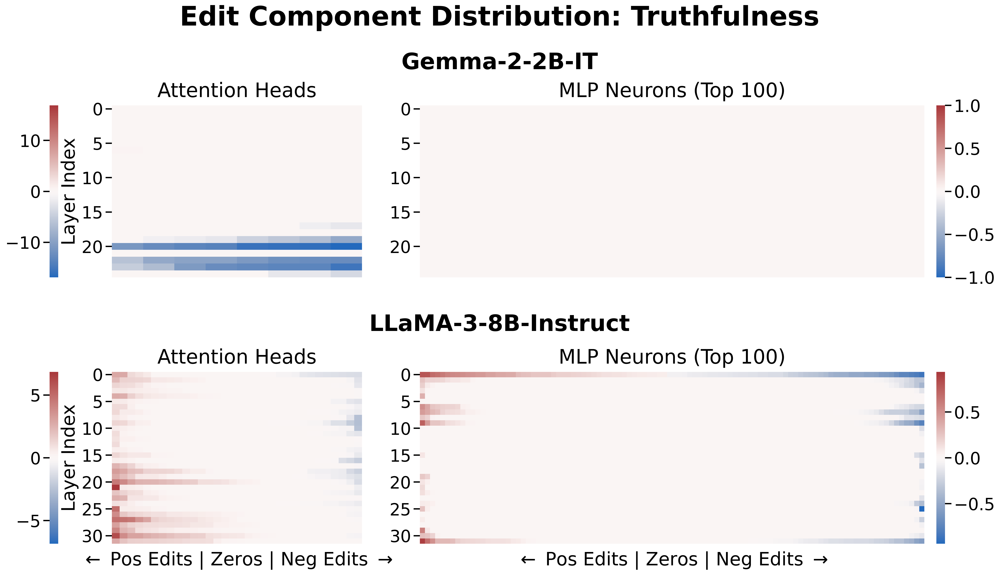
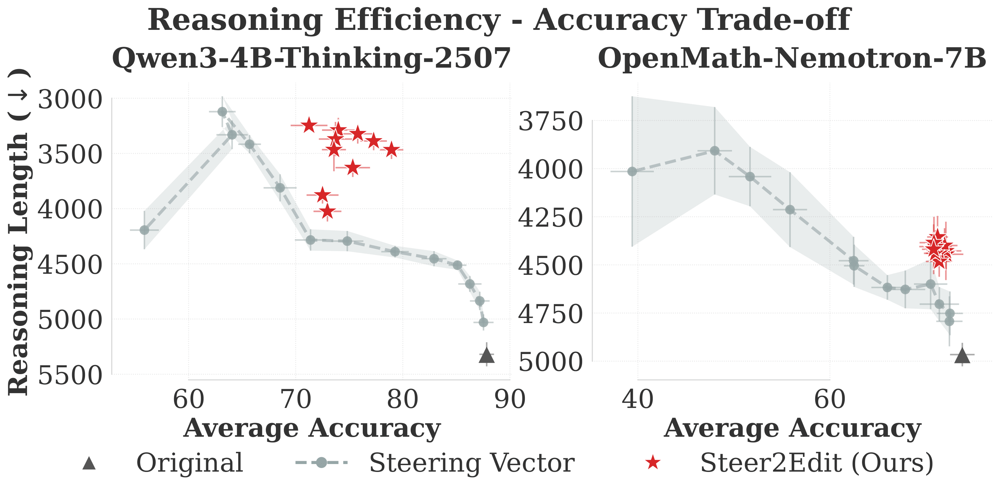
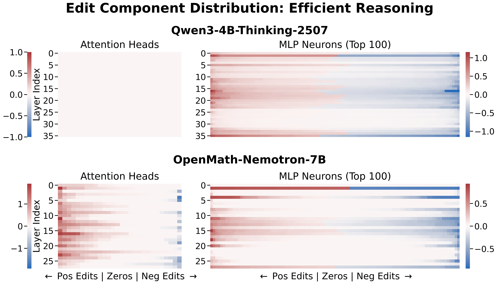

# Steer2Edit

This is the official repository for the paper: [**Steer2Edit: From Activation Steering to Component-Level Editing**](). Here is our 5 min read [project website](https://lilywenglab.github.io/Steer2Edit/).

<figure>
  
</figure>

This repository contains the full **Steer2Edit** pipeline with three behavior controls:
- `safety_alignment/`
- `truthfulness/`
- `efficient_reasoning/`

Each behavior control includes the data for probing, 

* Safety: `safety_alignment/data/` (advllm & gcg adversarial prompts, benign prompts from Alpaca dataset)
* Truth: `truthfulness/data/truthfulqa/`
* Efficiency: `efficient_reasoning/data/`

scripts for generating model responses and extracting steering vectors, component-level weight editing implementations, and evaluations across specific Steer2Edit configurations.


---

## Setup

```bash
pip install -r requirements.txt
````

---

## Safety alignment

**Models:** `llama2-7b`, `mistral-7b`

### 1) Generate probe responses

First, given harmful and neutral queries, generate responses for each model.

```bash
cd safety_alignment
python generate_response.py --model llama2-7b
python generate_response.py --model mistral-7b
```

### 2) Extract directions

Extract the steering vectors for refusal behavior after attention and MLP layers. The vectors will be saved in `directions/`.

```bash
python extract_directions.py --model llama2-7b
python extract_directions.py --model mistral-7b
```

### 3) Create edits

Run Steer2Edit based on the steering vectors. This creates multiple edits over a hyperparameter grid and saves all edits in `edited_models/`.

```bash
bash edit.sh --model llama2-7b
bash edit.sh --model mistral-7b
```

### 4) Attribute evaluation (safety)

Evaluate the refusal rate of each edit. We use vLLM to speed up inference; reduce `TENSOR_PARALLEL_SIZE=4` if you do not have 4 GPUs.

```bash
bash evaluate_editing.sh --model llama2-7b
bash evaluate_editing.sh --model mistral-7b
```

### 5) Utility evaluation (top-10 attribute configs)

This script selects the top 10 configurations based on the attribute evaluation results and evaluates the utility of the edited model.

```bash
python run_top_config_utility.py --model llama2-7b
python run_top_config_utility.py --model mistral-7b
```

### 6) Activation steering baseline

Run the baseline steering method with different steering strengths.

```bash
bash evaluate_steering.sh
bash evaluate_utility_steering.sh
```

### 7) Plot trade-off (safety vs utility)

Generate a trade-off plot similar to the one in the paper.

```bash
python plot.py --models llama2-7b,mistral-7b
```

### 8) Visualize edit strength (heatmap)

Plot the per-layer edit strength (λ) under the best hyperparameter setting to highlight which components drive the target attribute. You can switch to different hyperparameter settings; otherwise, this uses the best setting reported in the paper.

```bash
python visualize_edit.py \
  --model1 llama2-7b --rho_attn1 0.18 --rho_mlp1 0.55 --alpha1 0.8 \
  --model2 mistral-7b --rho_attn2 0.42 --rho_mlp2 0.55 --alpha2 0.75 \
```

**Expected figures:**

<div style="display: flex; justify-content: center; gap: 10px;">
  <figure style="flex: 1; max-width: 45%;">
    
    <figcaption align="center"><b>Safety-Utility Trade-off</b></figcaption>
  </figure>

  <figure style="flex: 1; max-width: 45%;">
    
    <figcaption align="center"><b>Heatmap of Edit Strength</b></figcaption>
  </figure>
</div>


---

## Truthfulness

**Models:** `gemma2-2b`, `llama3-8b`

### 1) Generate probe responses (TruthfulQA train split)

```bash
cd truthfulness
python generate_response.py --model gemma2-2b --probe_path data/truthfulqa/train
python generate_response.py --model llama3-8b --probe_path data/truthfulqa/train
```

### 2) Extract directions

Extract the steering vectors for truthfulness after attention and MLP layers. The vectors will be saved in `directions/`.

```bash
python extract_directions.py --model gemma2-2b
python extract_directions.py --model llama3-8b
```

### 3) Create edits

Run Steer2Edit based on the steering vectors. This creates multiple edits over a hyperparameter grid and saves all edits in `edited_models/`.

```bash
bash edit.sh --model gemma2-2b
bash edit.sh --model llama3-8b
```

### 4) Attribute evaluation (TruthfulQA)

Evaluate the TruthfulQA attribute metric for each edit.

```bash
bash evaluate_editing.sh --model gemma2-2b
bash evaluate_editing.sh --model llama3-8b
```

### 5) Utility evaluation (top-10 attribute configs)

This script selects the top 10 configurations based on the attribute evaluation results and evaluates the utility of the edited model.

```bash
python run_top_config_utility.py --model gemma2-2b
python run_top_config_utility.py --model llama3-8b
```

### 6) Activation steering baseline

Run the baseline steering method with different steering strengths.

```bash
bash evaluate_steering.sh
bash evaluate_utility_steering.sh
```

### 7) Plot trade-off (truthfulness vs utility)

Generate a trade-off plot similar to the one in the paper.

```bash
python plot.py --models gemma2-2b,llama3-8b
```

### 8) Visualize edit strength (heatmap)

Plot the per-layer edit strength (λ) under the best hyperparameter setting to highlight which components drive the target attribute. You can switch to different hyperparameter settings; otherwise, this uses the best setting reported in the paper.

```bash
python visualize_edit.py \
  --model1 gemma2-2b --rho_attn1 0.3 --rho_mlp1 -1.0 --alpha1 0.9 \
  --model2 llama3-8b --rho_attn2 0.1 --rho_mlp2 0.3 --alpha2 0.4 \
  --output_dir plots --filename edit_distribution_truth
```

**Expected figures:**

<div style="display: flex; justify-content: center; gap: 10px;">
  <figure style="flex: 1; max-width: 45%; text-align: center;">
    
    <figcaption><b>Truthfulness–Utility Trade-off</b></figcaption>
  </figure>

  <figure style="flex: 1; max-width: 45%; text-align: center;">
    
    <figcaption><b>Heatmap of Edit Strengths</b></figcaption>
  </figure>
</div>


---

## Efficient reasoning

**Reasoning Models:** `qwen3-4b-thinking`, `nemotron-7b`

### 1) Generate probe responses (subset of GSM8K train split)

```bash
cd efficient_reasoning
python generate_response.py --model qwen3-4b-thinking --probe_path data/gsm8k_probe.jsonl
python generate_response.py --model nemotron-7b --probe_path data/gsm8k_probe.jsonl
```

### 2) Extract directions

Extract the steering vectors for reasoning efficiency after attention and MLP layers. The vectors will be saved in `directions/`.

```bash
python extract_directions.py --model qwen3-4b-thinking
python extract_directions.py --model nemotron-7b
```

### 3) Create edits

Run Steer2Edit based on the steering vectors. This creates multiple edits over a hyperparameter grid and saves all edits in `edited_models/`.

```bash
bash edit.sh --model qwen3-4b-thinking
bash edit.sh --model nemotron-7b
```

### 4) Attribute and Utility evaluation (reasoning length & accuracy)

Evaluate each edit on accuracy and reasoning length.

```bash
bash evaluate_editing.sh --model qwen3-4b-thinking
bash evaluate_editing.sh --model nemotron-7b
```

### 5) Activation steering baseline

Run the baseline steering method with different steering strengths.

```bash
bash evaluate_steering.sh
```

### 6) Plot trade-off (reasoning length  vs accuracy)

Generate a trade-off plot similar to the one in the paper.

```bash
python plot.py --models qwen3-4b-thinking,nemotron-7b 
```

### 7) Visualize edit strength (heatmap)

Plot the per-layer edit strength (λ) under the best hyperparameter setting to highlight which components drive the target attribute. You can switch to different hyperparameter settings; otherwise, this uses the best setting reported in the paper.

```bash
python visualize_edit.py \
  --model1 qwen3-4b-thinking --rho_attn1 -1.0 --rho_mlp1 0.8 --alpha1 0.05 \
  --model2 nemotron-7b --rho_attn2 0.3 --rho_mlp2 0.9 --alpha2 0.2 \
  --output_dir plots --filename edit_distribution_efficiency
```

**Expected figures:**

<div style="display: flex; justify-content: center; gap: 10px;">
  <figure style="flex: 1; max-width: 45%; text-align: center;">
    
    <figcaption><b>Efficiency-Accuracy Trade-off</b></figcaption>
  </figure>

  <figure style="flex: 1; max-width: 45%; text-align: center;">
    
    <figcaption><b>Heatmap of Edit Strengths</b></figcaption>
  </figure>
</div>

---

## Citation

```bibtex
@article{steer2edit2026,
  title   = {Steer2Edit},
  author  = {TBD},
  journal = {arXiv},
  year    = {2026},
  note    = {placeholder}
}
```

